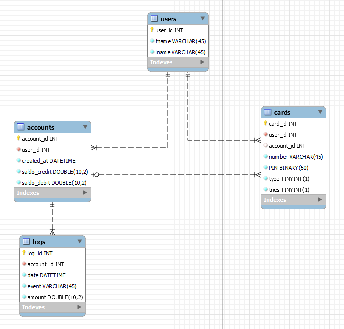
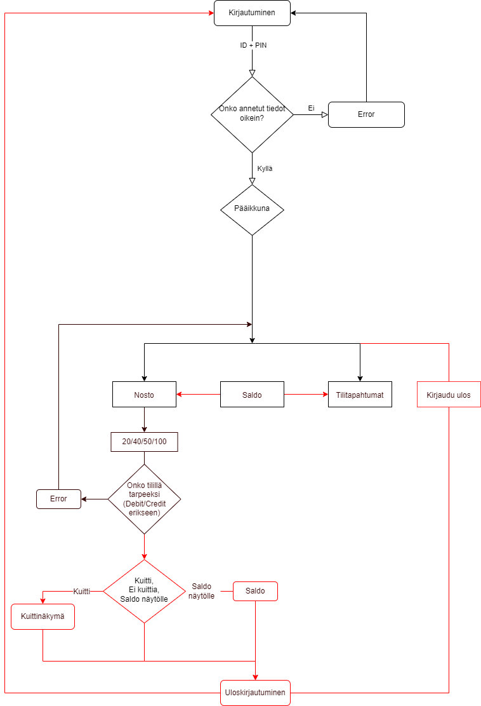

# BankSim

BankSim is an ATM-simulation. The app is built with node.js (backend), QT Creator (frontend) and mySQL (database)

## Features

BankSim contains the following features for the user to interact with:

- Check your account saldo
- Check the log history
- Draw out 20/40/50/100€ 

## Installation and usage

To build the app from sources:

```
# Clone the repository
git clone https://github.com/Banksimul2023-22SPL/group_3.git
```

Create a database in MySQL by using the provided .sql file:

```
mysql -u root -p < banksim.sql
```

To open the server, open the group_3 folder in VS Code and type in the terminal:

```
# Go to backend folder
cd backend
# Install dependencies
npm install
# Start the server
npm run start
```

To run the the app, go to QT Creator and open the project from the frontend folder by opening tester.pro file.

Be aware that you have to modify the .env file for your database and token.

## ER-diagram

ER-diagram  


## Flowchart

Flowchart

